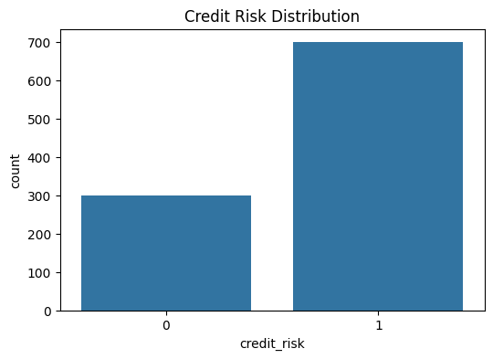
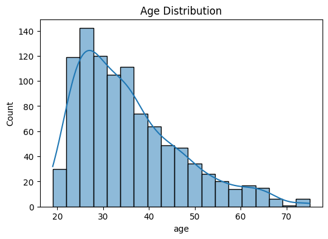
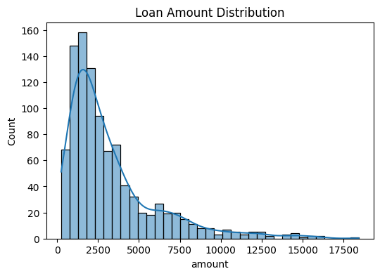
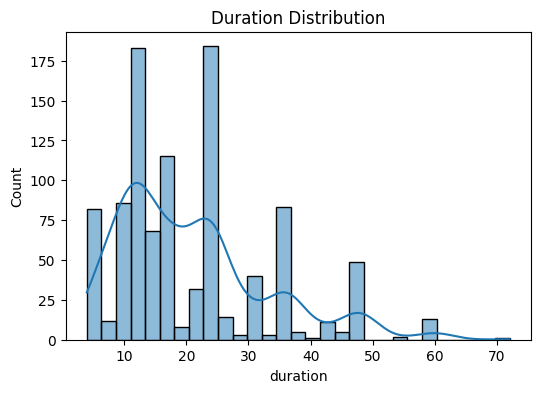
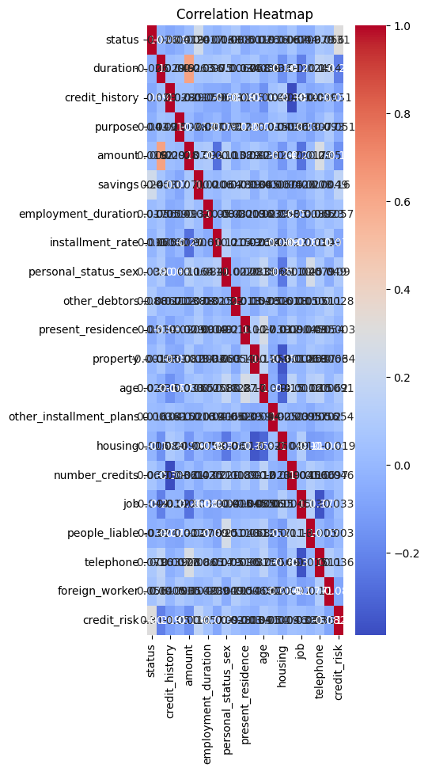
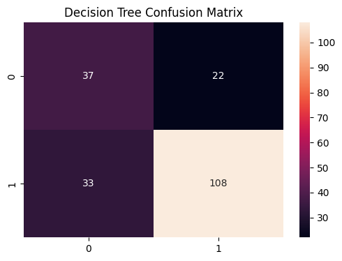
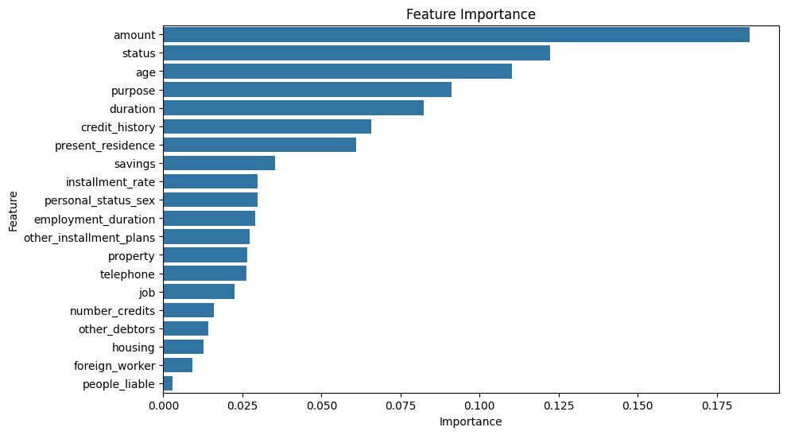
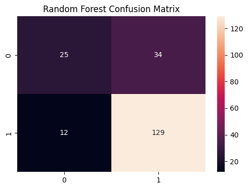

```python
import pandas as pd
df=pd.read_csv(r"C:\Users\Namo\Downloads\credit_risk.csv")
df.head()
```


<div>
<style scoped>
    .dataframe tbody tr th:only-of-type {
        vertical-align: middle;
    }

    .dataframe tbody tr th {
        vertical-align: top;
    }

    .dataframe thead th {
        text-align: right;
    }
</style>
<table border="1" class="dataframe">
  <thead>
    <tr style="text-align: right;">
      <th></th>
      <th>status</th>
      <th>duration</th>
      <th>credit_history</th>
      <th>purpose</th>
      <th>amount</th>
      <th>savings</th>
      <th>employment_duration</th>
      <th>installment_rate</th>
      <th>personal_status_sex</th>
      <th>other_debtors</th>
      <th>...</th>
      <th>property</th>
      <th>age</th>
      <th>other_installment_plans</th>
      <th>housing</th>
      <th>number_credits</th>
      <th>job</th>
      <th>people_liable</th>
      <th>telephone</th>
      <th>foreign_worker</th>
      <th>credit_risk</th>
    </tr>
  </thead>
  <tbody>
    <tr>
      <th>0</th>
      <td>... &lt; 100 DM</td>
      <td>6</td>
      <td>critical account/other credits existing</td>
      <td>domestic appliances</td>
      <td>1169</td>
      <td>unknown/no savings account</td>
      <td>... &gt;= 7 years</td>
      <td>4</td>
      <td>male : single</td>
      <td>none</td>
      <td>...</td>
      <td>real estate</td>
      <td>67</td>
      <td>none</td>
      <td>own</td>
      <td>2</td>
      <td>skilled employee/official</td>
      <td>1</td>
      <td>yes</td>
      <td>yes</td>
      <td>1</td>
    </tr>
    <tr>
      <th>1</th>
      <td>0 &lt;= ... &lt; 200 DM</td>
      <td>48</td>
      <td>existing credits paid back duly till now</td>
      <td>domestic appliances</td>
      <td>5951</td>
      <td>... &lt; 100 DM</td>
      <td>1 &lt;= ... &lt; 4 years</td>
      <td>2</td>
      <td>female : divorced/separated/married</td>
      <td>none</td>
      <td>...</td>
      <td>real estate</td>
      <td>22</td>
      <td>none</td>
      <td>own</td>
      <td>1</td>
      <td>skilled employee/official</td>
      <td>1</td>
      <td>no</td>
      <td>yes</td>
      <td>0</td>
    </tr>
    <tr>
      <th>2</th>
      <td>no checking account</td>
      <td>12</td>
      <td>critical account/other credits existing</td>
      <td>retraining</td>
      <td>2096</td>
      <td>... &lt; 100 DM</td>
      <td>4 &lt;= ... &lt; 7 years</td>
      <td>2</td>
      <td>male : single</td>
      <td>none</td>
      <td>...</td>
      <td>real estate</td>
      <td>49</td>
      <td>none</td>
      <td>own</td>
      <td>1</td>
      <td>unskilled - resident</td>
      <td>2</td>
      <td>no</td>
      <td>yes</td>
      <td>1</td>
    </tr>
    <tr>
      <th>3</th>
      <td>... &lt; 100 DM</td>
      <td>42</td>
      <td>existing credits paid back duly till now</td>
      <td>radio/television</td>
      <td>7882</td>
      <td>... &lt; 100 DM</td>
      <td>4 &lt;= ... &lt; 7 years</td>
      <td>2</td>
      <td>male : single</td>
      <td>guarantor</td>
      <td>...</td>
      <td>building society savings agreement/life insurance</td>
      <td>45</td>
      <td>none</td>
      <td>for free</td>
      <td>1</td>
      <td>skilled employee/official</td>
      <td>2</td>
      <td>no</td>
      <td>yes</td>
      <td>1</td>
    </tr>
    <tr>
      <th>4</th>
      <td>... &lt; 100 DM</td>
      <td>24</td>
      <td>delay in paying off in the past</td>
      <td>car (new)</td>
      <td>4870</td>
      <td>... &lt; 100 DM</td>
      <td>1 &lt;= ... &lt; 4 years</td>
      <td>3</td>
      <td>male : single</td>
      <td>none</td>
      <td>...</td>
      <td>unknown/no property</td>
      <td>53</td>
      <td>none</td>
      <td>for free</td>
      <td>2</td>
      <td>skilled employee/official</td>
      <td>2</td>
      <td>no</td>
      <td>yes</td>
      <td>0</td>
    </tr>
  </tbody>
</table>
<p>5 rows × 21 columns</p>
</div>


```python
import numpy as np
import matplotlib.pyplot as plt
import seaborn as sns
```


```python
from sklearn.model_selection import train_test_split
from sklearn.preprocessing import LabelEncoder
from sklearn.tree import DecisionTreeClassifier
from sklearn.ensemble import RandomForestClassifier
from sklearn.metrics import accuracy_score,classification_report,confusion_matrix
```


```python
df=pd.read_csv(r"C:\Users\Namo\Downloads\credit_risk.csv")
```


```python
df.head()
```


<div>
<style scoped>
    .dataframe tbody tr th:only-of-type {
        vertical-align: middle;
    }

    .dataframe tbody tr th {
        vertical-align: top;
    }

    .dataframe thead th {
        text-align: right;
    }
</style>
<table border="1" class="dataframe">
  <thead>
    <tr style="text-align: right;">
      <th></th>
      <th>status</th>
      <th>duration</th>
      <th>credit_history</th>
      <th>purpose</th>
      <th>amount</th>
      <th>savings</th>
      <th>employment_duration</th>
      <th>installment_rate</th>
      <th>personal_status_sex</th>
      <th>other_debtors</th>
      <th>...</th>
      <th>property</th>
      <th>age</th>
      <th>other_installment_plans</th>
      <th>housing</th>
      <th>number_credits</th>
      <th>job</th>
      <th>people_liable</th>
      <th>telephone</th>
      <th>foreign_worker</th>
      <th>credit_risk</th>
    </tr>
  </thead>
  <tbody>
    <tr>
      <th>0</th>
      <td>... &lt; 100 DM</td>
      <td>6</td>
      <td>critical account/other credits existing</td>
      <td>domestic appliances</td>
      <td>1169</td>
      <td>unknown/no savings account</td>
      <td>... &gt;= 7 years</td>
      <td>4</td>
      <td>male : single</td>
      <td>none</td>
      <td>...</td>
      <td>real estate</td>
      <td>67</td>
      <td>none</td>
      <td>own</td>
      <td>2</td>
      <td>skilled employee/official</td>
      <td>1</td>
      <td>yes</td>
      <td>yes</td>
      <td>1</td>
    </tr>
    <tr>
      <th>1</th>
      <td>0 &lt;= ... &lt; 200 DM</td>
      <td>48</td>
      <td>existing credits paid back duly till now</td>
      <td>domestic appliances</td>
      <td>5951</td>
      <td>... &lt; 100 DM</td>
      <td>1 &lt;= ... &lt; 4 years</td>
      <td>2</td>
      <td>female : divorced/separated/married</td>
      <td>none</td>
      <td>...</td>
      <td>real estate</td>
      <td>22</td>
      <td>none</td>
      <td>own</td>
      <td>1</td>
      <td>skilled employee/official</td>
      <td>1</td>
      <td>no</td>
      <td>yes</td>
      <td>0</td>
    </tr>
    <tr>
      <th>2</th>
      <td>no checking account</td>
      <td>12</td>
      <td>critical account/other credits existing</td>
      <td>retraining</td>
      <td>2096</td>
      <td>... &lt; 100 DM</td>
      <td>4 &lt;= ... &lt; 7 years</td>
      <td>2</td>
      <td>male : single</td>
      <td>none</td>
      <td>...</td>
      <td>real estate</td>
      <td>49</td>
      <td>none</td>
      <td>own</td>
      <td>1</td>
      <td>unskilled - resident</td>
      <td>2</td>
      <td>no</td>
      <td>yes</td>
      <td>1</td>
    </tr>
    <tr>
      <th>3</th>
      <td>... &lt; 100 DM</td>
      <td>42</td>
      <td>existing credits paid back duly till now</td>
      <td>radio/television</td>
      <td>7882</td>
      <td>... &lt; 100 DM</td>
      <td>4 &lt;= ... &lt; 7 years</td>
      <td>2</td>
      <td>male : single</td>
      <td>guarantor</td>
      <td>...</td>
      <td>building society savings agreement/life insurance</td>
      <td>45</td>
      <td>none</td>
      <td>for free</td>
      <td>1</td>
      <td>skilled employee/official</td>
      <td>2</td>
      <td>no</td>
      <td>yes</td>
      <td>1</td>
    </tr>
    <tr>
      <th>4</th>
      <td>... &lt; 100 DM</td>
      <td>24</td>
      <td>delay in paying off in the past</td>
      <td>car (new)</td>
      <td>4870</td>
      <td>... &lt; 100 DM</td>
      <td>1 &lt;= ... &lt; 4 years</td>
      <td>3</td>
      <td>male : single</td>
      <td>none</td>
      <td>...</td>
      <td>unknown/no property</td>
      <td>53</td>
      <td>none</td>
      <td>for free</td>
      <td>2</td>
      <td>skilled employee/official</td>
      <td>2</td>
      <td>no</td>
      <td>yes</td>
      <td>0</td>
    </tr>
  </tbody>
</table>
<p>5 rows × 21 columns</p>
</div>


# 2.Load Dataset


```python
print("First 5 Rows")
print(df.head())
```

    First 5 Rows
                    status  duration                            credit_history  \
    0         ... < 100 DM         6   critical account/other credits existing   
    1    0 <= ... < 200 DM        48  existing credits paid back duly till now   
    2  no checking account        12   critical account/other credits existing   
    3         ... < 100 DM        42  existing credits paid back duly till now   
    4         ... < 100 DM        24           delay in paying off in the past   
    
                   purpose  amount                     savings  \
    0  domestic appliances    1169  unknown/no savings account   
    1  domestic appliances    5951                ... < 100 DM   
    2           retraining    2096                ... < 100 DM   
    3     radio/television    7882                ... < 100 DM   
    4            car (new)    4870                ... < 100 DM   
    
      employment_duration  installment_rate                  personal_status_sex  \
    0      ... >= 7 years                 4                        male : single   
    1  1 <= ... < 4 years                 2  female : divorced/separated/married   
    2  4 <= ... < 7 years                 2                        male : single   
    3  4 <= ... < 7 years                 2                        male : single   
    4  1 <= ... < 4 years                 3                        male : single   
    
      other_debtors  ...                                           property age  \
    0          none  ...                                        real estate  67   
    1          none  ...                                        real estate  22   
    2          none  ...                                        real estate  49   
    3     guarantor  ...  building society savings agreement/life insurance  45   
    4          none  ...                                unknown/no property  53   
    
       other_installment_plans   housing number_credits  \
    0                     none       own              2   
    1                     none       own              1   
    2                     none       own              1   
    3                     none  for free              1   
    4                     none  for free              2   
    
                             job people_liable  telephone foreign_worker  \
    0  skilled employee/official             1        yes            yes   
    1  skilled employee/official             1         no            yes   
    2       unskilled - resident             2         no            yes   
    3  skilled employee/official             2         no            yes   
    4  skilled employee/official             2         no            yes   
    
      credit_risk  
    0           1  
    1           0  
    2           1  
    3           1  
    4           0  
    
    [5 rows x 21 columns]
    


```python
print("\nDataset Shape")
print(df.shape)
```

    
    Dataset Shape
    (1000, 21)
    


```python
print(df.info())
```

    <class 'pandas.core.frame.DataFrame'>
    RangeIndex: 1000 entries, 0 to 999
    Data columns (total 21 columns):
     #   Column                   Non-Null Count  Dtype 
    ---  ------                   --------------  ----- 
     0   status                   1000 non-null   object
     1   duration                 1000 non-null   int64 
     2   credit_history           1000 non-null   object
     3   purpose                  1000 non-null   object
     4   amount                   1000 non-null   int64 
     5   savings                  1000 non-null   object
     6   employment_duration      1000 non-null   object
     7   installment_rate         1000 non-null   int64 
     8   personal_status_sex      1000 non-null   object
     9   other_debtors            1000 non-null   object
     10  present_residence        1000 non-null   int64 
     11  property                 1000 non-null   object
     12  age                      1000 non-null   int64 
     13  other_installment_plans  1000 non-null   object
     14  housing                  1000 non-null   object
     15  number_credits           1000 non-null   int64 
     16  job                      1000 non-null   object
     17  people_liable            1000 non-null   int64 
     18  telephone                1000 non-null   object
     19  foreign_worker           1000 non-null   object
     20  credit_risk              1000 non-null   int64 
    dtypes: int64(8), object(13)
    memory usage: 164.2+ KB
    None
    


```python
print(df.isnull().sum())
```

    status                     0
    duration                   0
    credit_history             0
    purpose                    0
    amount                     0
    savings                    0
    employment_duration        0
    installment_rate           0
    personal_status_sex        0
    other_debtors              0
    present_residence          0
    property                   0
    age                        0
    other_installment_plans    0
    housing                    0
    number_credits             0
    job                        0
    people_liable              0
    telephone                  0
    foreign_worker             0
    credit_risk                0
    dtype: int64
    


```python
print(df.describe())
```

              duration        amount  installment_rate  present_residence  \
    count  1000.000000   1000.000000       1000.000000        1000.000000   
    mean     20.903000   3271.258000          2.973000           2.845000   
    std      12.058814   2822.736876          1.118715           1.103718   
    min       4.000000    250.000000          1.000000           1.000000   
    25%      12.000000   1365.500000          2.000000           2.000000   
    50%      18.000000   2319.500000          3.000000           3.000000   
    75%      24.000000   3972.250000          4.000000           4.000000   
    max      72.000000  18424.000000          4.000000           4.000000   
    
                   age  number_credits  people_liable  credit_risk  
    count  1000.000000     1000.000000    1000.000000  1000.000000  
    mean     35.546000        1.407000       1.155000     0.700000  
    std      11.375469        0.577654       0.362086     0.458487  
    min      19.000000        1.000000       1.000000     0.000000  
    25%      27.000000        1.000000       1.000000     0.000000  
    50%      33.000000        1.000000       1.000000     1.000000  
    75%      42.000000        2.000000       1.000000     1.000000  
    max      75.000000        4.000000       2.000000     1.000000  
    

#  4.Data Preprocessing


```python
#Encode Categorical Columns

le=LabelEncoder()

for col in df.columns:
    if df[col].dtype=='object':
     df[col]=le.fit_transform(df[col])
```


```python
df.head()
```


<div>
<style scoped>
    .dataframe tbody tr th:only-of-type {
        vertical-align: middle;
    }

    .dataframe tbody tr th {
        vertical-align: top;
    }

    .dataframe thead th {
        text-align: right;
    }
</style>
<table border="1" class="dataframe">
  <thead>
    <tr style="text-align: right;">
      <th></th>
      <th>status</th>
      <th>duration</th>
      <th>credit_history</th>
      <th>purpose</th>
      <th>amount</th>
      <th>savings</th>
      <th>employment_duration</th>
      <th>installment_rate</th>
      <th>personal_status_sex</th>
      <th>other_debtors</th>
      <th>...</th>
      <th>property</th>
      <th>age</th>
      <th>other_installment_plans</th>
      <th>housing</th>
      <th>number_credits</th>
      <th>job</th>
      <th>people_liable</th>
      <th>telephone</th>
      <th>foreign_worker</th>
      <th>credit_risk</th>
    </tr>
  </thead>
  <tbody>
    <tr>
      <th>0</th>
      <td>0</td>
      <td>6</td>
      <td>1</td>
      <td>3</td>
      <td>1169</td>
      <td>4</td>
      <td>1</td>
      <td>4</td>
      <td>3</td>
      <td>2</td>
      <td>...</td>
      <td>2</td>
      <td>67</td>
      <td>1</td>
      <td>1</td>
      <td>2</td>
      <td>1</td>
      <td>1</td>
      <td>1</td>
      <td>1</td>
      <td>1</td>
    </tr>
    <tr>
      <th>1</th>
      <td>2</td>
      <td>48</td>
      <td>3</td>
      <td>3</td>
      <td>5951</td>
      <td>0</td>
      <td>2</td>
      <td>2</td>
      <td>0</td>
      <td>2</td>
      <td>...</td>
      <td>2</td>
      <td>22</td>
      <td>1</td>
      <td>1</td>
      <td>1</td>
      <td>1</td>
      <td>1</td>
      <td>0</td>
      <td>1</td>
      <td>0</td>
    </tr>
    <tr>
      <th>2</th>
      <td>3</td>
      <td>12</td>
      <td>1</td>
      <td>9</td>
      <td>2096</td>
      <td>0</td>
      <td>3</td>
      <td>2</td>
      <td>3</td>
      <td>2</td>
      <td>...</td>
      <td>2</td>
      <td>49</td>
      <td>1</td>
      <td>1</td>
      <td>1</td>
      <td>3</td>
      <td>2</td>
      <td>0</td>
      <td>1</td>
      <td>1</td>
    </tr>
    <tr>
      <th>3</th>
      <td>0</td>
      <td>42</td>
      <td>3</td>
      <td>7</td>
      <td>7882</td>
      <td>0</td>
      <td>3</td>
      <td>2</td>
      <td>3</td>
      <td>1</td>
      <td>...</td>
      <td>0</td>
      <td>45</td>
      <td>1</td>
      <td>0</td>
      <td>1</td>
      <td>1</td>
      <td>2</td>
      <td>0</td>
      <td>1</td>
      <td>1</td>
    </tr>
    <tr>
      <th>4</th>
      <td>0</td>
      <td>24</td>
      <td>2</td>
      <td>1</td>
      <td>4870</td>
      <td>0</td>
      <td>2</td>
      <td>3</td>
      <td>3</td>
      <td>2</td>
      <td>...</td>
      <td>3</td>
      <td>53</td>
      <td>1</td>
      <td>0</td>
      <td>2</td>
      <td>1</td>
      <td>2</td>
      <td>0</td>
      <td>1</td>
      <td>0</td>
    </tr>
  </tbody>
</table>
<p>5 rows × 21 columns</p>
</div>


# 5.Exploratory Data Analysis


```python
# Credit Risk Distribution

plt.figure(figsize=(6,4))
sns.countplot(x='credit_risk',data=df)
plt.title("Credit Risk Distribution")
plt.show()
```


    

    


```python
#Age Distribution

plt.figure(figsize=(6,4))
sns.histplot(df['age'],kde=True)
plt.title("Age Distribution")
plt.show()
```


    

    


```python
#Loan Amount Distribution

plt.figure(figsize=(6,4))
sns.histplot(df['amount'],kde=True)
plt.title("Loan Amount Distribution")
plt.show()
```


    

    


```python
#Duration Distribution

plt.figure(figsize=(6,4))
sns.histplot(df['duration'],kde=True)
plt.title("Duration Distribution")
plt.show()
```


    

    


```python
#Correlation Heatmap

plt.figure(figsize=(4,10))
sns.heatmap(df.corr(),annot=True,cmap='coolwarm')
plt.title("Correlation Heatmap")
plt.show()
```


    

    


# 6.Features And Target


```python
X=df.drop('credit_risk',axis=1)
y=df['credit_risk']
```


```python
print(df.columns)
```

    Index(['status', 'duration', 'credit_history', 'purpose', 'amount', 'savings',
           'employment_duration', 'installment_rate', 'personal_status_sex',
           'other_debtors', 'present_residence', 'property', 'age',
           'other_installment_plans', 'housing', 'number_credits', 'job',
           'people_liable', 'telephone', 'foreign_worker', 'credit_risk'],
          dtype='object')
    

# 7.Train Test Split


```python
X_train,X_test,y_train,y_test=train_test_split(
    X,
    y,
    test_size=0.20,
    random_state=42
)
```

# 8. Decision Tree Model


```python
dt_model=DecisionTreeClassifier(
    random_state=42
)
dt_model.fit(X_train,y_train)
dt_pred=dt_model.predict(X_test)
```

# 9.Decision Tree Evaluation


```python
print("\nDecision  Tree Accuracy:")
print(accuracy_score(y_test,dt_pred))

print("\nClassification Report:")
print(classification_report(y_test,dt_pred))

cm=confusion_matrix(y_test,dt_pred)

plt.figure(figsize=(6,4))
sns.heatmap(cm,annot=True,fmt='d')
plt.title("Decision Tree Confusion Matrix")
plt.show()
```

    
    Decision  Tree Accuracy:
    0.725
    
    Classification Report:
                  precision    recall  f1-score   support
    
               0       0.53      0.63      0.57        59
               1       0.83      0.77      0.80       141
    
        accuracy                           0.72       200
       macro avg       0.68      0.70      0.69       200
    weighted avg       0.74      0.72      0.73       200
    
    


    

    


# 10. Feature Importance


```python
importance=pd.DataFrame({
    'Feature':X.columns,
    'Importance':dt_model.feature_importances_})

importance=importance.sort_values(
    by='Importance',
    ascending=False
)

print("\nFeature Importance")
print(importance)

plt.figure(figsize=(10,6))
sns.barplot(
    x='Importance',
    y='Feature',
    data=importance
)
plt.title("Feature Importance")
plt.show()

```

    
    Feature Importance
                        Feature  Importance
    4                    amount    0.185489
    0                    status    0.122354
    12                      age    0.110280
    3                   purpose    0.091245
    1                  duration    0.082376
    2            credit_history    0.065856
    10        present_residence    0.061071
    5                   savings    0.035335
    7          installment_rate    0.029813
    8       personal_status_sex    0.029745
    6       employment_duration    0.029032
    13  other_installment_plans    0.027253
    11                 property    0.026519
    18                telephone    0.026171
    16                      job    0.022521
    15           number_credits    0.015956
    9             other_debtors    0.014140
    14                  housing    0.012658
    19           foreign_worker    0.009261
    17            people_liable    0.002923
    


    

    


# 11. Random Forest Model


```python
rf_model=RandomForestClassifier(
    n_estimators=100,
    random_state=42
)
rf_model.fit(X_train,y_train)
rf_pred=rf_model.predict(X_test)
```

# 12.Random Forest Evaluation


```python
print("\nRandom Forestt Accuracy:")
print(accuracy_score(y_test,rf_pred))

print("\nClassification Report:")
print(classification_report(y_test,rf_pred))

rf_cm=confusion_matrix(
    y_test,
    rf_pred
)
plt.figure(figsize=(6,4))
sns.heatmap(
    rf_cm,
    annot=True,
    fmt='d'
)
plt.title("Random Forest Confusion Matrix")
plt.show()
```

    
    Random Forestt Accuracy:
    0.77
    
    Classification Report:
                  precision    recall  f1-score   support
    
               0       0.68      0.42      0.52        59
               1       0.79      0.91      0.85       141
    
        accuracy                           0.77       200
       macro avg       0.73      0.67      0.68       200
    weighted avg       0.76      0.77      0.75       200
    
    


    

    


# 13. Model Comparison


```python
dt_accuracy=accuracy_score(
    y_test,
    dt_pred
)

rf_accuracy=accuracy_score(
    y_test,
    rf_pred
)
comparison=pd.DataFrame({
    'Model':[
        'Decision Tree',
        'Random Forest'
    ],
    'Accuracy':[
        dt_accuracy,
        rf_accuracy
    ]
    })
print("\nModel Comparison")
print(comparison)

                        
```

    
    Model Comparison
               Model  Accuracy
    0  Decision Tree     0.725
    1  Random Forest     0.770
    

# 14. Conclusion

#
This project developed a machine-learning based Credit Risk Assessment system.
That predicts whether an applicant is likely to be a good or bad credit risk.

Data Preprocessing ,exploratory Data analysis (EDA) and classification models were implemented on the dataset.
Decison Tree and Random Forest Classifiers were trained and evaluated using accuracy,confusion matrix  and classification Reports.

Based on the model comparison,the model with the higher accuracy can be considered as more effective for predicting credit risk.
Such models can help financial institutions make informed decisions regarding lending and reduced potential financial losses.

Among the evaluated models,the Random Forest Classifier achieved the highest accuracy (77%) and was selected as the best performing model for credit risk prediction.
